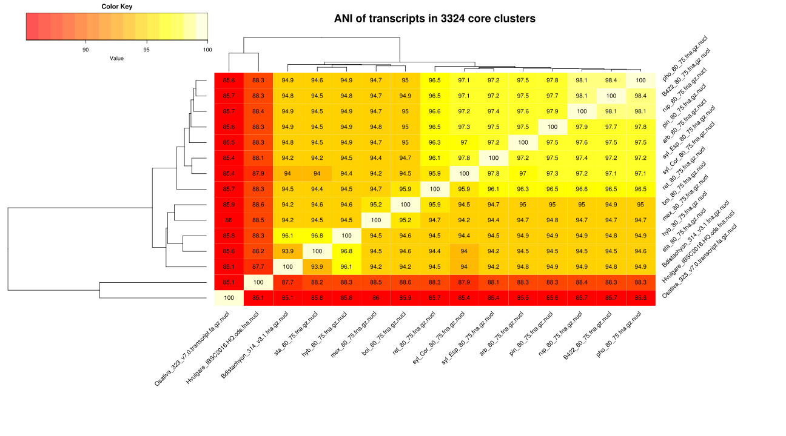

# allopolyploids

This pipeline was designed by Ruben Sancho, Pilar Catalan and Bruno Contreras Moreira for the selection of transcripts for phylogeny reconstruction of allopolyploid species.
We tested it with diploid and polyploid species of the genus Brachypodium, for which we had data obtained in collaboration with David des Marais. We believe the ideas and the code could be taylored to other clades as well.


## 0) Core transcripts expressed in all Brachypodium species plus two outgroups: rice & barley

This first step requires https://github.com/eead-csic-compbio/get_homologues and the set of transcripts in folder [genome_transcripts](./genome_transcripts), most of them assembled de novo with https://github.com/trinityrnaseq/trinityrnaseq

```
get_homologues/get_homologues-est.pl -d genome_transcripts/ -m cluster -I \
	genome_transcripts/species.list -M -A -S 80 &> \
	genome_transcriptslog.gen.M.A.S80.core.clusters
```

This produces 3324 clusters (see this [folder](./00_get_homologues/genome_transcripts_est_homologues/arb8075_alltaxa_species.list_algOMCL_e0_S80_)) and an Average Nucleotide Identity (ANI) matrix, which we can plot with: 

````
get_homologues/plot_matrix_heatmap.sh -i 00_get_homologues/genome_transcripts_est_homologues/arb8075_alltaxa_no_sorghum.list_algOMCL_e0_S80_Avg_identity.tab \
	-H 10 -W 18 -t "ANI of transcripts in 3324 core clusters" -o svg -d 1
```


# The core clusters obtained in the previous section are used to compile a pangenome matrix without singletons

get_homologues/compare_clusters.pl -d 00_get_homologues_est/genome_transcripts_est_homologues/arb8075_alltaxa_no_sorghum.list_algOMCL_e0_S80_ \
   -o core_clusters_Hordeum -m -n &> log.compare.core


# Produce a multiple alignment view of the supporting local BLAST alignments of sequences in a cluster and annotate Pfam domains.


for FILE in `ls core_clusters_Hordeum/*gethoms.fna; do
   echo $FILE;
   get_homologues/annotate_cluster.pl -D -f $FILE -o $FILE.aln.fna -c 20 &>> log.core.collapse.align
done

see 00_get_homologues

NOTE: core_clusters_Hordeum/*gethoms.fna files do not save


############################################################################################################################

######################################################## nearest diploid species node algorithm #####################################################

# Simplify headers (Users have to adapt it for each kind of header) 

mkdir 01_core_transcript_aligned

NOTE: *collapsed.fna.gethoms.fna.aln.fna files do not save

for FILE in *collapsed.fna.gethoms.fna.aln.fna; do
echo $FILE;
perl -p -i -e 's/>(.+?) .+/>$1/g; s/:\d+:\d+:[+-]//g' $FILE;
done


# Take a FASTA multiple alignment of [nucleotide] sequences of diploid and polyploid species and produces a trimmed MSA suitable for phylogenetic tree inference.
# The goal is to define a solid diploid backbone, which should be covered by outgroup sequences as well, and then use it to filter out polyploid sequences with diploid block overlap < $MINBLOCKOVERLAP

mkdir 02_blocks

for FILE in *.fna; do
echo $FILE;
perl _trim_MSA_block.pl $FILE $FILE.block.fna &>> log.blocks;
done


# trimAl (https://vicfero.github.io/trimal/)

# "Trim the alignment searching for optimum thresholds based on inherent characteristics of the input alignment"

mkdir 03_blocks_trimmed

for FILE in *block.fna; do
echo $FILE;
trimal/source/trimal -in $FILE -out $FILE.trimmed.fna -automated1;
done


# Compute ML gene trees by IQ-TREE software (http://www.iqtree.org)

ls *.trimmed.fna | parallel --gnu -j 3 iqtree-omp-1.5.5-Linux/bin/iqtree-omp -alrt 1000 -bb 1000 -nt 3 -AICc -s {} :::

mkdir 04_iqtree

IMPORTANT: some sequences (and species) could be removed.

# Root and sort nodes in trees

mkdir 05_iqtree_rooted_sorted

for FILE in *treefile; do
perl _reroot_tree.pl $FILE > $FILE.root.ph;
echo $FILE;
done 


# Check how many different diploid backbones there are and select gene trees with consistent diploid backbone

Run into 05_iqtree_rooted_sorted

for FILE in *root.ph; do
perl _check_diploids.pl $FILE _Osat; done > log.diploids;
done


## Print statistics in table format

grep -v "#" log.diploids | \
   perl -F"," -ane 'foreach $tx (0 .. $#F){ $ord{$F[$tx]}{$tx}++ } END{ foreach $tx (keys(%ord)){ print "$tx"; foreach $t (0 .. 6){ printf("\t%d",$ord{$tx}{$t}||0) } print "\n" } }'


Osat    1707    0       0       0       0       0       0
Hvul    0       1527    46      31      17      7       0
Bsta    0       64      936     247     90      53      0
Bdis    0       54      444     708     145     124     0
Barb    0       22      75      104     585     596     0
Bpin    0       20      72      100     390     567     167
Bsyl    0       20      77      112     363     286     431

Hvul*   0       0       10      11      0       0       18
Bsta*   0       0       15      198     20      9       75
Bdis*   0       0       12      128     23      7       62
Barb*   0       0       5       19      30      26      245
Bpin*   0       0       8       25      24      8       294
Bsyl*   0       0       7       24      20      23      332


### Print topology predominance list

sort log.diploids  | uniq -c | sort -n

grep -B 8 --no-group-separator -e 'Osat,Hvul,Bsta,Bdis,Barb,Bsyl,Bpin,' -e 'Osat,Hvul,Bsta,Bdis,Barb,Bpin,Bsyl,' log.diploids | grep treefile.root.ph | sed 's/# //g' | sed 's/ /\n/g' > list.diploids_congruent_pruned_diploid_topology


## Copy files (root.ph and root.ph.pruned) and fna with congruent diploid topologies in directory "06_diploid_clusters_pruned_diploid_topology"

mkdir 06_diploid_clusters_pruned_diploid_topology

ls | grep -f list.diploids_congruent_pruned_diploid_topology | xargs cp -t 06_diploid_clusters_pruned_diploid_topology/

ls *.root.ph | sed 's/.treefile.root.ph//g' > list_fna_06_diploid_clusters_pruned_diploid_topology

ls | grep -f list_fna_06_diploid_clusters_pruned_diploid_topology | xargs cp -t 06_diploid_clusters_pruned_diploid_topology/

## Save .root.ph and fna files

## 275 root.ph
## 275 root.ph.pruned
## 275 fna

# Label allopolyploid sequences with @CODES according to their position with respect to the diploid backbone.
# INPUT: Reads multiple sequence alignment (MSA) corresponding to input tree file (.root.ph) 
# OUTPUT: produces two labelled MSA files with sorted diploid and polyploid (A,B,C,etc) species, a full MSA with some only-gap rows, and a reduced MSA excluding those.
# Ad-hoc rules encoded herein (see below) define pairs of diploid species where one on the can be missing in the alignment.


ls -1 *root.ph | perl -lne 'print `../../_check_lineages_polyploids_ABCDEFGHI.pl $_`' &> log.lineage_codes_blocks_ABCDEFGHI


labelled files (fna, ph) moved --> 07_files_labelled_ABCDEFGHI

### check de visu and correct if it is necessary

# STATISTICS POLYPLOIDS (ABCDEFGHI) using pruned diploid strategy and _check_lineages_polyploids_ABCDEFGHI

 list_subgenomes.txt


IMPORTANT: Note that those labels are showed as lowercase letter in the paper

      A    B     C    D    E    F    G    H    I     all
Bhyb  2    137   2    90   0    0    0    0    1     232
Bmex  94   46    42   4    15   1    2    0    0     204
Bboi  87   37    49   9    32   5    4    0    0     223
Bret  42   12    40   9    63   21   31   9    17    244
Brup  0    1     2    5    53   29   71   49   45    255
B422  1    2     3    4    56   40   66   37   36    245
Bpho  1    0     4    4    66   42   64   30   43    254


############################################################# SECOND CHECKING ROUND OF LABELLED TREES #########################################################################


Those steps create a huge amount of files. Steps, scripts and onelines are showed, but those files are not included here.

See "08_bootstrapping_check"


# Create FASTA files pruned with all diploids plus one allopolyploid sequences for each aligned cluster

## Remove sequences with only gaps using trimAl

Input placed in 07_files_labelled_ABCDEFGHI

Remove lines with all gaps

for FILE in *corrected_simplified.sort.fna; do
echo $FILE;
trimal/source/trimal -in $FILE -out $FILE.trimmed.fna -noallgaps;
done

## Extract multifasta using list of references for each species and label (allels)


Example for all labels (A, B, C, D, E, F, G, H and I) of B422 species. Repeat in each files and species

see file Bmex_A.list.txt

for FILE in *.trimmed.fna; do cat Bmex_A.list.txt | awk '{gsub("_","\\_",$0);$0="(?s)^>"$0".*?(?=\\n(\\z|>))"}1' | pcregrep -oM -f - $FILE > $FILE.extract_Bmex_A.fna; done


## Find and save FASTA files including allopoliploid sequences

Example: codes of allopolyploids species: Bmex; Bret; Bboi; Bhyb; Brup; Bpho and B422

grep -E 'Bmex|Bret|Bboi|Bhyb|Brup|Bpho|B422' *.fna | cut -d":" -f1 > list_files_extract_allopoly.txt


## copy and save those files:

ls | grep -f list_files_extract_allopoly.txt | xargs mv -t DIRECTORY


# Create non-paremetric bootstrapping trees using IQ-TREE

## Input corresponds to FASTA alinged files with diploid sequences plus polyploid sequences.

See input example --> 99716_c37819_extract_Bmex_A.fna

ls *.fna | parallel --gnu -j 50 iqtree-1.6.9-Linux/bin/iqtree -b 1000 -nt 1 -AICc -s {} :::

Output --> 1000 bootstrapping trees for each fna file 


# Run bootstrap_label_stats.pl script to root, sort and re-label bootstrapping trees

Input --> iqtree_non_parametric_bootstrap_1000 directory with .boottrees for IQTREE bootstrapping

See exaple --> iqtree_non_parametric_bootstrap_1000 including two boottrees files (98131_c38723_extract_Bmex_A.fna.boottrees; 99182_c38366_extract_Bhyb_B.fna.boottrees)

perl bootstrap_label_stats.pl iqtree_non_parametric_bootstrap_1000


output --> directory with files relabelled (98131_c38723_extract_Bmex_A.fna.boottrees.relabelled; 99182_c38366_extract_Bhyb_B.fna.boottrees.relabelled)
For each boottrees file splits trees (.ph), roots (.root.ph) and relabel (.label.ph) and print statistics in screen


# Check diploid backbone for all boottrap trees rooted and relabel

for FILE in *.root.ph; do
perl _check_diploids.pl $FILE Osat;
done &>> stats_diploid_skeleton_1000_boot.log

Example:

# File name

# Osat  1       Osat
# Hvul  2       Hvul
# Bsta  3       Bsta
# Bdis  4       Bdis
# Barb  5       Barb
# Bpin  6       Bpin
# Bsyl  7       Bsyl
Osat,Hvul,Bsta,Bdis,Barb,Bpin,Bsyl,


# Print match and 8th line (topology), keep first (file name) and second column; remove "# .\"; rows to column (files topologies) and sort by files and then by numbers of bootstrap files (from 1 to 1000):

awk 'c&&!--c;/# .\//{print $0; c=8}' stats_diploid_skeleton_1000_boot.log | cut -d" " -f1,2 | sed 's/# .\///g' | awk '{printf "%s%s",$0,NR%2?"\t":RS}' | sort -t/ -k1,1 -k2,2n > table_files_topologies_1000.tsv

Example:

100546_c28312.extract_B422_E.fna.boottrees.relabelled/1.root.ph    Osat,Hvul,Bsta,Bdis,Barb,Bpin,Bsyl,


# Find acepted topologies: Acepted topologies: 'Osat,Hvul,Bsta,Bdis,Barb,Bsyl,Bpin,'; 'Osat,Hvul,Bsta,Bdis,Barb,Bpin,Bsyl,'

sed -r 's/\/[0-9]+\.root.ph//g' table_files_topologies_1000.tsv | grep -e 'Osat,Hvul,Bsta,Bdis,Barb,Bsyl,Bpin,' -e 'Osat,Hvul,Bsta,Bdis,Barb,Bpin,Bsyl,' | uniq -c > STATS_acepted_topologies_1000_bootstrapping.txt


Example:

# trees	directory name	topology

239 97589_c38733.extract_Bmex_B.fna.boottrees.relabelled     Osat,Hvul,Bsta,Bdis,Barb,Bpin,Bsyl,


# To sum up topologies for the same files:

awk '{a[$2]+=$1}END{for(i in a) print i,a[i]}' STATS_acepted_topologies_1000_bootstrapping.txt


# Keep names in each files with correct topology

cat table_files_topologies_1000.tsv | grep -e 'Osat,Hvul,Bsta,Bdis,Barb,Bsyl,Bpin,' -e 'Osat,Hvul,Bsta,Bdis,Barb,Bpin,Bsyl,' 


# New trimal round to remove columns with all gaps after filtering steps

for FILE in *.fna; do
echo $FILE;
trimal/source/trimal -in $FILE -out $FILE.trimmed.fna -noallgaps -keepseqs;
done


# Concatenate genes partitions

ls *.trimmed.fna > list.txt

get_phylomarkers/concat_alignments.pl list.txt > MSA.fna


# Remove underrepresented labels (our criteria < 12 labels or 10%)


# Consensus labels --> from labels to alleles

see 09_consensus_labels

Criteria:

Patristic distances (see Excel)

subgenomic assignation (PREGUNTAR A ANTONIO)


## Create consensus sequences for each species and alleles:

Extract sequences to collapse:

One liner example:

perl -lne 'if(/^(>.*)/){ $head=$1 } else { $fa{$head} .= $_ } END{ foreach $s (keys(%fa)){ print "$s\n$fa{$s}\n" if($s =~ /Bpho_F/ || $s =~ /Bpho_G/ || $s =~ /Bpho_H/|| $s =~ /Bpho_I/) }}' MSA.fasta > Bpho_F_G_H_I.fasta


Collapse labels (use collapse script, multiple options)

https://github.com/josephhughes/Sequence-manipulation/blob/master/Consensus.pl

perl Consensus.pl -iupac -in Bpho_F_G_H_I.fasta -out Bpho_H_consensus.fasta


Finally, cluster all consensus sequences and coduct downstream phylogenomics analyses


